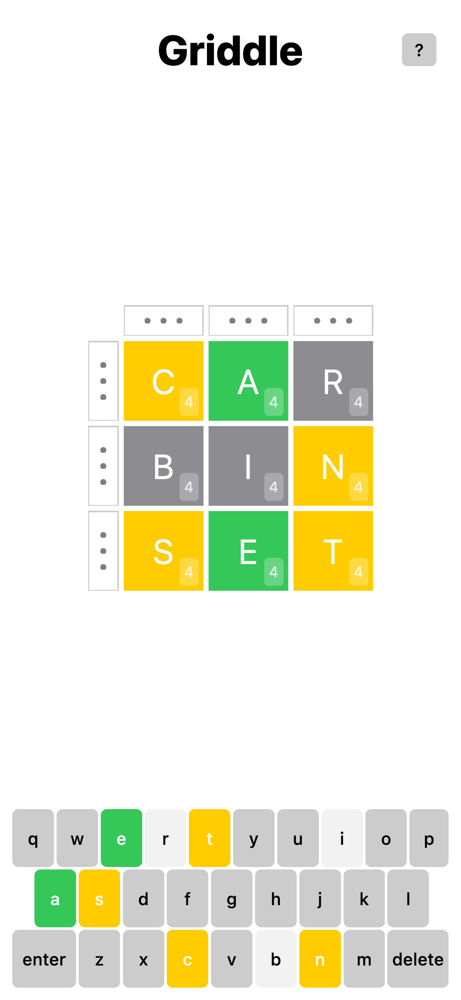

# [Griddle](https://griddle.buildpassed.com)

> Wordle, but in a grid.



This game was built to demonstrate [Tokamak](https://github.com/TokamakUI/Tokamak#fiber-renderers)'s Fiber backend, which can match SwiftUI nearly 1:1 on the web.

## Getting Started

You can play at [griddle.buildpassed.com](https://griddle.buildpassed.com), or you can clone to play locally.

### Running with Carton
Install [Carton](https://github.com/swiftwasm/carton):
```sh
brew install swiftwasm/tap/carton
```

Enter this package's root directory and start the site:
```sh
carton dev
```

## How to Play

Each row and column forms a word.
Find all six words to win.

You can make up to 5 guesses per tile.

Tap on a selector to enter a row/column.
Then you can start typing.

Letters will change color to indicate various states.

* Green means the letter is correct. You cannot change a green letter.
* Yellow means the letter goes somewhere else in the grid
* Gray means the letter is not in the word

Each guess does not need to make a fully valid grid.

If you make more than 5 guesses in any tile, you lose.
